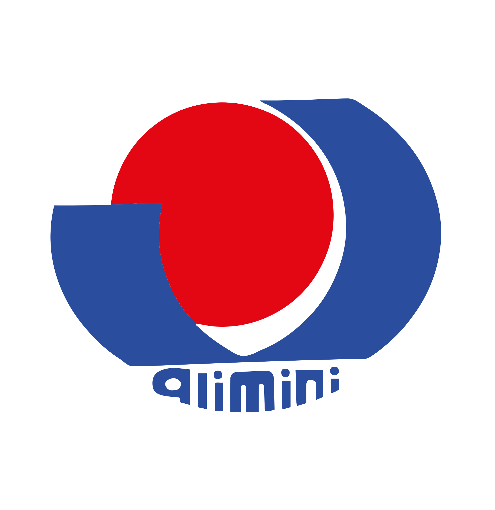

  

# Spiaggia Alimini Next 🏖️

**Sistema Gestionale Avanzato per l'Amministrazione e le Assegnazioni Balneari**

---

## 📖 Descrizione

**Spiaggia Alimini Next** è il software gestionale progettato per la gestione delle prenotazioni e delle assegnazioni dei posti spiaggia del comprensorio _Serra Degli Alimini 1_.

Il sistema combina un database locale super-veloce, sincronizzazione in tempo reale e una griglia interattiva per offrire un'esperienza d'uso fluida, reattiva e priva di attriti anche in assenza di rete.

---

## ✨ Funzionalità Principali

- 👥 **Gestione Ospiti**: Anagrafica clienti e prenotazioni.
- 🏖️ **Griglia Assegnazioni Dinamica**: Controllo visivo immediato del layout della spiaggia con drag-and-drop per ombrelloni, lettini e sdraio, ottimizzando l'occupazione.
- 📅 **Registro Arrivi & Partenze**: Vista giornaliera dedicata per semplificare le operazioni di check-in e check-out del personale.
- 🖨️ **Stampa e Reportistica**: Generazione di anteprime di stampa in formato A4 pronte all'uso per i bagnini e per fini amministrativi.
- ⚙️ **Sincronizzazione in Background (PowerSync & Supabase)**: Lavora offline senza pensieri. Il sistema sincronizza automaticamente i dati non appena la connessione torna disponibile.
- 🔄 **Aggiornamenti Automatici Integrati**: Riconosce le nuove release su GitHub e aggiorna l'app con un solo clic.

---

## 🚀 Guida all'Installazione

### 🖥️ Desktop (Windows)

1. Vai alla pagina delle **[Release Ufficiali](https://github.com/AntonioR95/Spiaggia-Alimini-Next/releases)**.
2. Scarica la versione più recente (.exe).
3. Fai doppio clic sul file .exe scaricato per avviare l'installazione.
4. Avvia **Spiaggia Alimini Next** ed effettua l'accesso per iniziare a gestire la spiaggia.

### 📱 Mobile (Android)

1. Vai alla pagina delle **[Release Ufficiali](https://github.com/AntonioR95/Spiaggia-Alimini-Next/releases)**.
2. Scarica il file `.apk` dalla release più recente.
3. Consenti l'installazione da fonti sconosciute se necessario.
4. Installa e avvia l'app.

### 🔄 Sistema di Auto-Update

Non c'è bisogno di scaricare manualmente le versioni future! Quando viene rilasciata una nuova versione su questo repository, l'applicazione ti avviserà automaticamente all'avvio con una notifica e si aggiornerà con un solo clic.

---

## 🛠️ Stack Tecnologico

Il sistema è stato riscritto e modernizzato:

- **Electron 42+** — Motore desktop.
- **Capacitor 8+** — Wrapper mobile per Android.
- **Next.js 16+ & React 19+** — Framework per l'interfaccia utente.
- **TypeScript 6.0+** — Tipizzazione rigida e sicura per eliminare errori di runtime.
- **Bootstrap 5 & Vanilla CSS** — Stile moderno.
- **PowerSync & Supabase** — Database SQLite locale con sincronizzazione automatica in background.
